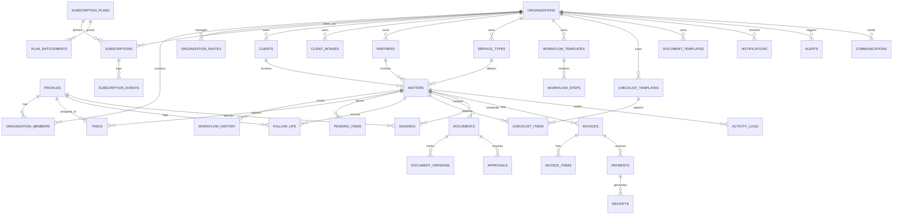

# DATABASE ERD (Entity Relationship Diagram)

```mermaid
erDiagram
    PROFILES ||--o{ ORGANIZATION_MEMBERS : has
    ORGANIZATIONS ||--o{ ORGANIZATION_MEMBERS : contains
    ORGANIZATIONS ||--o{ ORGANIZATION_INVITES : manages
    ORGANIZATIONS ||--o{ SUBSCRIPTIONS : billed_via

    SUBSCRIPTION_PLANS ||--o{ SUBSCRIPTIONS : defines
    SUBSCRIPTION_PLANS ||--o{ PLAN_ENTITLEMENTS : grants
    SUBSCRIPTIONS ||--o{ SUBSCRIPTION_EVENTS : logs

    ORGANIZATIONS ||--o{ CLIENTS : owns
    ORGANIZATIONS ||--o{ CLIENT_INTAKES : owns
    ORGANIZATIONS ||--o{ PARTNERS : owns
    ORGANIZATIONS ||--o{ SERVICE_TYPES : owns
    ORGANIZATIONS ||--o{ WORKFLOW_TEMPLATES : owns
    ORGANIZATIONS ||--o{ CHECKLIST_TEMPLATES : owns
    ORGANIZATIONS ||--o{ DOCUMENT_TEMPLATES : owns

    WORKFLOW_TEMPLATES ||--o{ WORKFLOW_STEPS : contains
    SERVICE_TYPES ||--o{ MATTERS : defines

    CLIENTS ||--o{ MATTERS : involves
    PARTNERS ||--o{ MATTERS : involves

    MATTERS ||--o{ WORKFLOW_HISTORY : tracks
    MATTERS ||--o{ TASKS : spawns
    MATTERS ||--o{ PENDING_ITEMS : blocks
    MATTERS ||--o{ FOLLOW_UPS : records
    MATTERS ||--o{ CHECKLIST_ITEMS : requires
    MATTERS ||--o{ DOCUMENTS : contains
    MATTERS ||--o{ SIGNINGS : schedules
    MATTERS ||--o{ INVOICES : bills
    MATTERS ||--o{ ACTIVITY_LOGS : audits

    CHECKLIST_TEMPLATES ||--o{ CHECKLIST_ITEMS : spawns
    DOCUMENTS ||--o{ DOCUMENT_VERSIONS : tracks
    DOCUMENTS ||--o{ APPROVALS : requires

    PROFILES ||--o{ TASKS : assigned_to
    PROFILES ||--o{ FOLLOW_UPS : logs
    PROFILES ||--o{ SIGNINGS : attends

    INVOICES ||--o{ INVOICE_ITEMS : lists
    INVOICES ||--o{ PAYMENTS : receives
    PAYMENTS ||--o{ RECEIPTS : generates

    ORGANIZATIONS ||--o{ NOTIFICATIONS : receives
    ORGANIZATIONS ||--o{ ALERTS : triggers
    ORGANIZATIONS ||--o{ COMMUNICATIONS : sends
```
