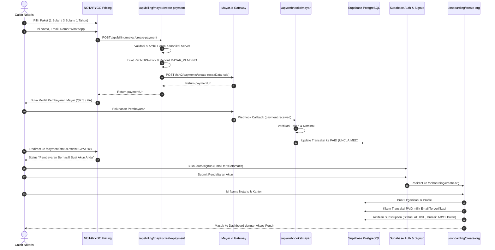

# NOTARYGO™ PAYMENT-TO-SIGNUP WORKFLOW
**Document Version:** 1.0.0  
**Feature:** Pay-First, Register-After (Pre-Signup Payment Claiming)  

---

## 1. Business Context & Objective
Prospective Notary Office clients frequently choose a subscription plan directly from marketing landing pages or pricing tables before creating an account.
NOTARYGO™ guarantees that payments made prior to account registration are never lost. When the user completes signup with the verified payment email, the subscription is automatically claimed and attached to their new organization.

---

## 2. End-to-End Sequence

---

## 3. Email Normalization & Claim Security
1. **Email Normalization:**
   All emails are normalized using `email.toLowerCase().trim()`. Case differences (e.g. `User@Notary.Com` vs `user@notary.com`) do not prevent automatic claiming.
2. **Ownership Verification:**
   Anonymous users cannot claim transactions by simply typing an email. The user must authenticate through Supabase Auth, which verifies email control before `/onboarding/actions.ts` executes the claim.
3. **Mismatched Email Protection:**
   If a user pays with `email-a@example.com` but signs up with `email-b@example.com`, the claim will not execute and the organization remains inactive, preventing unauthorized access.
