# ERD NOTARYGO™ SUPERADMIN
## Platform Administration Data Model

**Versi:** 1.0  
**Database:** Supabase PostgreSQL  
**Model:** Multi-tenant SaaS + Single Platform Superadmin

---

# 1. Prinsip ERD

ERD ini **tidak bermaksud mengganti schema NOTARYGO™ yang sudah ada**. Antigravity wajib mengaudit schema existing dan:

- `KEEP` tabel yang sudah benar;
- `EXTEND` jika hanya kurang field;
- `REFACTOR` hanya jika diperlukan;
- membuat tabel baru hanya untuk konsep yang benar-benar belum ada.

Prinsip utama:

1. `organizations` adalah tenant/kantor.
2. `organization_members` adalah membership user tenant.
3. Platform admin terpisah dari role tenant.
4. Subscription dimiliki organization.
5. Payment transaction terpisah dari subscription.
6. Provider webhook event disimpan idempotently.
7. Semua action Superadmin penting memiliki audit trail.
8. Data support, feedback, health, attention, dan renewal tidak boleh merusak core domain.

---

# 2. Mermaid ERD

```mermaid
erDiagram
    AUTH_USERS ||--o| PROFILES : has
    AUTH_USERS ||--o{ ORGANIZATION_MEMBERS : joins
    ORGANIZATIONS ||--o{ ORGANIZATION_MEMBERS : contains

    AUTH_USERS ||--o| PLATFORM_ADMINS : authorizes

    ORGANIZATIONS ||--o{ SUBSCRIPTIONS : owns
    SUBSCRIPTION_PLANS ||--o{ SUBSCRIPTIONS : defines
    SUBSCRIPTION_PLANS ||--o{ PLAN_ENTITLEMENTS : includes

    ORGANIZATIONS ||--o{ BILLING_TRANSACTIONS : billed_for
    SUBSCRIPTION_PLANS ||--o{ BILLING_TRANSACTIONS : purchased_plan
    AUTH_USERS ||--o{ BILLING_TRANSACTIONS : claimed_by

    BILLING_TRANSACTIONS ||--o{ SUBSCRIPTION_EVENTS : generates
    SUBSCRIPTIONS ||--o{ SUBSCRIPTION_EVENTS : records

    BILLING_TRANSACTIONS ||--o{ PROVIDER_WEBHOOK_EVENTS : matched_to
    PROVIDER_WEBHOOK_EVENTS ||--o| RECONCILIATION_ITEMS : may_create

    ORGANIZATIONS ||--o{ CUSTOMER_HEALTH_SNAPSHOTS : measured
    ORGANIZATIONS ||--o{ CUSTOMER_LIFECYCLE_EVENTS : progresses
    ORGANIZATIONS ||--o{ PRODUCT_USAGE_EVENTS : produces

    ORGANIZATIONS ||--o{ SUPPORT_TICKETS : opens
    AUTH_USERS ||--o{ SUPPORT_TICKETS : requests

    ORGANIZATIONS ||--o{ FEEDBACK_ITEMS : submits
    AUTH_USERS ||--o{ FEEDBACK_ITEMS : authors

    FEEDBACK_ITEMS }o--o{ FEATURE_REQUEST_GROUPS : grouped_into

    ORGANIZATIONS ||--o{ RENEWAL_ACTIVITIES : tracked
    SUBSCRIPTIONS ||--o{ RENEWAL_ACTIVITIES : belongs_to

    BILLING_TRANSACTIONS ||--o{ REFUND_REQUESTS : refund_for

    ORGANIZATIONS ||--o{ ADMIN_NOTES : has
    SUBSCRIPTIONS ||--o{ ADMIN_NOTES : may_have
    BILLING_TRANSACTIONS ||--o{ ADMIN_NOTES : may_have
    SUPPORT_TICKETS ||--o{ ADMIN_NOTES : may_have

    PLATFORM_ADMINS ||--o{ PLATFORM_ADMIN_AUDIT_LOGS : performs

    ORGANIZATIONS ||--o{ STORAGE_USAGE_SNAPSHOTS : consumes
    ORGANIZATIONS ||--o{ SYSTEM_INCIDENTS : may_affect

    PLATFORM_SETTINGS ||--o{ PLATFORM_ADMIN_AUDIT_LOGS : changes
```



---

# 3. Tabel Inti Existing yang Harus Diintegrasikan

## 3.1 `auth.users`

Supabase Auth source of truth untuk identity.

Key fields digunakan:

- id
- email
- email_confirmed_at
- created_at
- last_sign_in_at

Jangan duplikasi password.

## 3.2 `profiles`

Contoh:

- id UUID PK/FK -> auth.users.id
- full_name
- phone
- avatar_url
- created_at
- updated_at

## 3.3 `organizations`

Tenant kantor Notaris/PPAT.

Recommended fields:

- id UUID PK
- name
- owner_user_id FK auth.users
- status
- onboarding_status
- created_at
- updated_at

## 3.4 `organization_members`

- id UUID PK
- organization_id FK
- user_id FK
- role
- status
- joined_at
- created_at

Role:

- OWNER
- ADMIN
- SUPERVISOR
- STAFF
- FINANCE

Tidak boleh menyimpan `PLATFORM_SUPERADMIN` di tabel ini.

---

# 4. Platform Admin

## `platform_admins`

Tujuan: server-side mapping identity ke akses platform.

Fields:

- id UUID PK
- user_id UUID UNIQUE NOT NULL FK auth.users
- email CITEXT/normalized text UNIQUE NOT NULL
- role TEXT NOT NULL CHECK role = 'PLATFORM_SUPERADMIN'
- status TEXT NOT NULL CHECK status IN ('ACTIVE','INACTIVE')
- created_at TIMESTAMPTZ
- last_login_at TIMESTAMPTZ

Constraint bisnis:

- produksi hanya boleh mempunyai satu `ACTIVE` platform admin;
- email active wajib `bungradjen@gmail.com`;
- tidak ada UI create platform admin.

---

# 5. Subscription

## `subscription_plans`

- id UUID PK
- code TEXT UNIQUE
- name TEXT
- price_amount BIGINT
- currency TEXT DEFAULT 'IDR'
- duration_months INTEGER
- is_active BOOLEAN
- created_at
- updated_at

Canonical:

- NOTARYGO_MONTHLY / 129000 / 1
- NOTARYGO_QUARTERLY / 249000 / 3
- NOTARYGO_ANNUAL / 499000 / 12

## `plan_entitlements`

- id UUID PK
- plan_id UUID FK
- entitlement_key TEXT
- entitlement_value JSONB
- created_at
- updated_at

Unique:

`(plan_id, entitlement_key)`

## `subscriptions`

- id UUID PK
- organization_id UUID FK
- plan_id UUID FK
- status TEXT
- start_at TIMESTAMPTZ
- current_period_end TIMESTAMPTZ
- provider TEXT
- provider_customer_id TEXT NULL
- provider_subscription_id TEXT NULL
- created_at
- updated_at

Recommended index:

- organization_id
- status
- current_period_end

---

# 6. Billing Transactions

## `billing_transactions`

- id UUID PK
- organization_id UUID NULL FK
- user_id UUID NULL FK auth.users
- normalized_email TEXT NOT NULL
- customer_name TEXT
- customer_phone TEXT
- plan_id UUID FK
- internal_reference TEXT UNIQUE NOT NULL
- provider TEXT NOT NULL
- provider_payment_id TEXT NULL
- provider_invoice_id TEXT NULL
- provider_payment_url TEXT NULL
- amount BIGINT NOT NULL
- currency TEXT DEFAULT 'IDR'
- status TEXT NOT NULL
- claim_status TEXT
- created_at TIMESTAMPTZ
- paid_at TIMESTAMPTZ NULL
- claimed_at TIMESTAMPTZ NULL
- metadata JSONB

Suggested status:

- CREATED
- MAYAR_PENDING
- PAID
- FAILED
- EXPIRED
- CANCELLED
- REFUNDED

Claim status:

- UNCLAIMED
- CLAIMED

Indexes:

- normalized_email
- status
- claim_status
- paid_at
- provider_payment_id
- internal_reference

---

# 7. Subscription Events

## `subscription_events`

- id UUID PK
- subscription_id UUID NULL FK
- transaction_id UUID NULL FK
- provider TEXT
- provider_event_id TEXT NULL
- event_type TEXT
- event_payload JSONB NULL (sanitized)
- status TEXT
- processed_at TIMESTAMPTZ
- created_at TIMESTAMPTZ

Unique provider event ID jika tersedia.

---

# 8. Provider Webhook Events

## `provider_webhook_events`

Tujuan: menyimpan delivery provider secara idempotent dan bisa diaudit.

- id UUID PK
- provider TEXT NOT NULL
- provider_event_id TEXT NULL
- event_type TEXT
- transaction_id UUID NULL FK
- provider_payment_id TEXT NULL
- received_at TIMESTAMPTZ
- processed_at TIMESTAMPTZ NULL
- status TEXT
- retry_count INTEGER DEFAULT 0
- error_code TEXT NULL
- error_message_sanitized TEXT NULL
- payload_hash TEXT NULL
- payload_sanitized JSONB NULL

Status:

- PROCESSED
- DUPLICATE
- INVALID
- FAILED
- IGNORED
- NEEDS_REVIEW

Unique partial index pada `(provider, provider_event_id)` jika provider event id tersedia.

---

# 9. Reconciliation

## `reconciliation_items`

- id UUID PK
- type TEXT
- transaction_id UUID NULL FK
- subscription_id UUID NULL FK
- organization_id UUID NULL FK
- webhook_event_id UUID NULL FK
- expected_state JSONB
- actual_state JSONB
- severity TEXT
- status TEXT
- detected_at TIMESTAMPTZ
- resolved_at TIMESTAMPTZ NULL
- resolution_note TEXT NULL
- created_at
- updated_at

Type contoh:

- PROVIDER_PAID_INTERNAL_PENDING
- PAYMENT_PAID_SUBSCRIPTION_INACTIVE
- CLAIMED_WITHOUT_ORGANIZATION
- ENTITLEMENT_MISMATCH

Status:

- OPEN
- RETRYING
- RESOLVED
- IGNORED

---

# 10. Customer Health

## `customer_health_snapshots`

Optional jika tidak dihitung real-time.

- id UUID PK
- organization_id UUID FK
- health_status TEXT
- score INTEGER NULL
- signals JSONB
- calculated_at TIMESTAMPTZ

Health status:

- HEALTHY
- WATCH
- AT_RISK

Jika health dapat dihitung efisien real-time, tabel snapshot tidak wajib.

---

# 11. Customer Lifecycle

## `customer_lifecycle_events`

- id UUID PK
- organization_id UUID NULL FK
- user_id UUID NULL FK
- transaction_id UUID NULL FK
- stage TEXT
- occurred_at TIMESTAMPTZ
- metadata JSONB

Stage:

- CHECKOUT_STARTED
- PAYMENT_PENDING
- PAID
- PAID_UNCLAIMED
- REGISTERED
- OFFICE_CREATED
- ONBOARDING
- ACTIVATED
- ACTIVE_CUSTOMER
- EXPIRING_SOON
- RENEWED
- EXPIRED
- CANCELLED

Append-only lebih disukai.

---

# 12. Product Usage

## `product_usage_events`

Jika analytics existing belum tersedia.

- id UUID PK
- organization_id UUID FK
- user_id UUID NULL FK
- event_name TEXT
- module TEXT
- occurred_at TIMESTAMPTZ
- metadata JSONB NULL

Tidak menyimpan confidential document body.

Event contoh:

- matter_created
- task_created
- document_uploaded
- pdf_generated
- invoice_created
- staff_invited
- onboarding_completed
- feature_viewed

Index:

- organization_id
- event_name
- module
- occurred_at

---

# 13. Support

## `support_tickets`

- id UUID PK
- organization_id UUID NULL FK
- user_id UUID NULL FK
- category TEXT
- priority TEXT
- status TEXT
- subject TEXT
- description TEXT
- created_at
- updated_at
- resolved_at NULL

Priority:

- LOW
- MEDIUM
- HIGH
- CRITICAL

Status:

- OPEN
- IN_PROGRESS
- WAITING_CUSTOMER
- RESOLVED
- CLOSED

---

# 14. Feedback

## `feedback_items`

- id UUID PK
- organization_id UUID NULL FK
- user_id UUID NULL FK
- category TEXT
- message TEXT
- status TEXT
- internal_note TEXT NULL
- created_at
- updated_at

Category:

- BUG
- IMPROVEMENT
- FEATURE_REQUEST
- COMPLAINT
- GENERAL_FEEDBACK

Status:

- REQUESTED
- UNDER_REVIEW
- PLANNED
- IN_DEVELOPMENT
- RELEASED
- REJECTED

## `feature_request_groups`

- id UUID PK
- title TEXT
- normalized_key TEXT UNIQUE
- description TEXT
- status TEXT
- created_at
- updated_at

## `feature_request_group_items`

Join table:

- feature_request_group_id UUID FK
- feedback_item_id UUID FK

Unique composite key.

---

# 15. Renewal Operations

## `renewal_activities`

- id UUID PK
- organization_id UUID FK
- subscription_id UUID FK
- contact_status TEXT
- channel TEXT NULL
- note TEXT NULL
- next_action_at TIMESTAMPTZ NULL
- created_at
- updated_at

Contact statuses:

- NOT_CONTACTED
- REMINDER_SENT
- WHATSAPP_SENT
- INTERESTED
- RENEWED
- NO_RESPONSE
- DECLINED

---

# 16. Refunds

## `refund_requests`

- id UUID PK
- transaction_id UUID FK
- organization_id UUID NULL FK
- amount BIGINT
- reason TEXT
- provider_status TEXT NULL
- internal_status TEXT
- requested_at TIMESTAMPTZ
- resolved_at TIMESTAMPTZ NULL
- resolved_by UUID NULL FK auth.users

Jangan membuat provider status yang tidak benar-benar diterima provider.

---

# 17. Internal Admin Notes

## `admin_notes`

Generic note table:

- id UUID PK
- entity_type TEXT
- entity_id UUID
- author_user_id UUID FK auth.users
- content TEXT
- created_at TIMESTAMPTZ

Entity types:

- ORGANIZATION
- SUBSCRIPTION
- PAYMENT
- SUPPORT_TICKET

Tenant user tidak dapat membaca table ini.

---

# 18. Platform Audit Log

## `platform_admin_audit_logs`

Append-only.

- id UUID PK
- admin_user_id UUID FK auth.users
- action TEXT
- target_type TEXT
- target_id TEXT
- reason TEXT NULL
- before_state JSONB NULL
- after_state JSONB NULL
- metadata JSONB NULL
- created_at TIMESTAMPTZ

No normal UPDATE/DELETE.

---

# 19. Storage Usage Snapshot

## `storage_usage_snapshots`

Jika usage tidak tersedia efisien secara live.

- id UUID PK
- organization_id UUID FK
- storage_used_bytes BIGINT
- document_count BIGINT
- quota_bytes BIGINT NULL
- calculated_at TIMESTAMPTZ

---

# 20. System Incidents

## `system_incidents`

- id UUID PK
- service TEXT
- severity TEXT
- status TEXT
- error_code TEXT NULL
- organization_id UUID NULL FK
- operation TEXT NULL
- message_sanitized TEXT
- detected_at TIMESTAMPTZ
- resolved_at TIMESTAMPTZ NULL
- metadata JSONB NULL

Status:

- OPEN
- INVESTIGATING
- RESOLVED
- IGNORED

---

# 21. Platform Settings

## `platform_settings`

- key TEXT PK
- value JSONB
- description TEXT
- updated_by UUID FK auth.users
- updated_at TIMESTAMPTZ

Allowed use:

- renewal thresholds
- health thresholds
- inactivity thresholds
- attention thresholds

Jangan menyimpan:

- Mayar API key
- webhook secret
- Supabase service-role key

Secret harus tetap environment/server secret store.

---

# 22. RLS / Access Model

## Tenant Users

Tenant users tidak boleh SELECT:

- platform_admins
- platform_admin_audit_logs
- reconciliation_items lintas tenant
- platform settings internal
- all organizations
- all transactions
- system incidents lintas tenant

## Platform Superadmin

Akses Superadmin dilakukan melalui trusted server-side endpoints/helpers.

Prefer:

- service role hanya di server;
- `requireSuperadmin()` sebelum platform query;
- jangan memberikan service role ke browser.

---

# 23. Recommended Indexes

Minimum:

```text
organizations(status)
organization_members(organization_id, user_id)
subscriptions(organization_id)
subscriptions(status)
subscriptions(current_period_end)
billing_transactions(normalized_email)
billing_transactions(status)
billing_transactions(claim_status)
billing_transactions(paid_at)
billing_transactions(provider_payment_id)
provider_webhook_events(provider, provider_event_id)
provider_webhook_events(status, received_at)
reconciliation_items(status, severity)
customer_lifecycle_events(organization_id, stage, occurred_at)
product_usage_events(organization_id, occurred_at)
support_tickets(status, priority)
feedback_items(status, category)
renewal_activities(organization_id, contact_status)
platform_admin_audit_logs(created_at)
```

---

# 24. Referential Integrity Rules

- Jangan cascade-delete organization ke financial/audit history tanpa explicit policy.
- Billing transaction harus tetap historis.
- Webhook event harus tetap historis.
- Audit log harus immutable.
- Subscription history jangan hilang ketika plan berubah.
- Feedback/support boleh di-archive, bukan dihapus sembarangan.

---

# 25. Migration Rule

Antigravity wajib:

1. audit schema existing;
2. menghasilkan migration additive;
3. tidak reset production DB;
4. tidak drop table existing tanpa alasan terverifikasi;
5. menjaga RLS;
6. membuat rollback strategy jika perubahan signifikan;
7. menjalankan migration di dev/test sebelum production.
